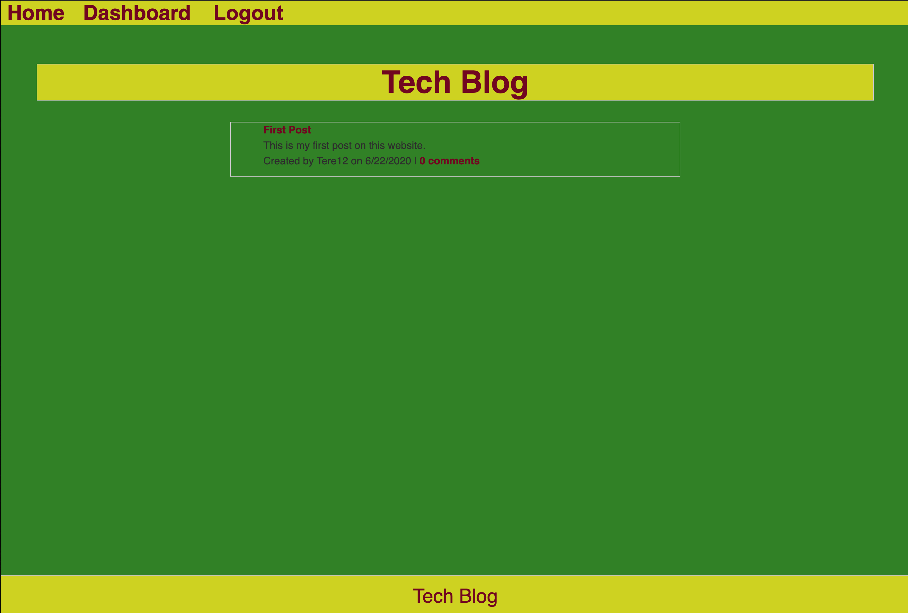

# Tech Blog
  
  ## Description
  A CMS-style blog site similar to a Wordpress site, where developers can publish their blog posts and comment on other developers’ posts as well.
  ## Table of Contents
  * [Installation](#installation)
  * [Usage](#usage)
  * [Credits](#credits)
  * [License](#license)
  * [Tests](#tests)
  * [Questions](#questions)
  ## Installation
  No installation required simply to go https://glacial-savannah-58858.herokuapp.com/ to access it.
  ## Link Deployed Application
  * https://glacial-savannah-58858.herokuapp.com/
  ## Usage
  Go to the link provided above, create an account, and get started!
  
  ## License
  Licensed under MIT.
  ## Credits
  N/A
  ## Tests
  N/A
  ## Questions
  Please feel free to contact me. GitHub & LinkedIn links provided below along with my Email.
  * [GitHub](github.com/saul10huerta)
  * [Email](saul10huerta@utexas.edu)
  * [LinkedIn](https://www.linkedin.com/in/saul10huerta/)